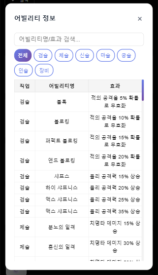
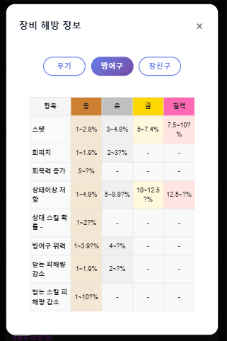
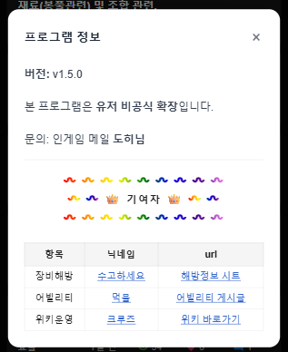

# Lanis Helper - 크롬 확장프로그램

> **본 확장 프로그램은 라니스 공식이 아닌 유저 비공식 확장입니다.**

Lanis 사용자 경험을 향상시키는 크롬 확장프로그램입니다.

- 크롬 웹스토어 (1.4.0) : [이동하기](https://chromewebstore.google.com/detail/lanis-helper/ciemdjbfifddfgbdlfimomejgpnfonjd?authuser=0&hl=ko)

- 최신릴리즈 (1.5.2) : [다운받기](https://github.com/user-attachments/files/21381210/lanis_helper_1.5.2.zip)

- 깃허브 저장소 : [이동하기](https://github.com/dohits/lanis_helper?tab=readme-ov-file)

- 위키 : [이동하기](https://laniswiki.lovestoblog.com/index.php/%ED%8A%B9%EC%88%98:%EC%B5%9C%EA%B7%BC%EB%B0%94%EB%80%9C?hidebots=1&limit=50&days=7&enhanced=1&urlversion=2&i=1)

## 🚀 설치 방법

최신 릴리즈 다운 후 설치방법 (크롬 웹스토어는 해당 없음)

### PC (Chrome 브라우저)

1. 버전에 맞는 릴리즈를 다운로드 합니다. (압축 해제 할 것)
2. Chrome 브라우저에서 `chrome://extensions/` 접속
3. 우측 상단의 "개발자 모드" 활성화
4. "압축해제된 확장 프로그램을 로드합니다" 클릭
5. 프로젝트 폴더 선택

### 모바일 (Android)

1. 버전에 맞는 릴리즈를 다운로드 합니다. (압축 해제 하지 말 것)
2. 플레이 스토어에서 Mises 브라우저 다운로드
3. 하단바에서 퍼즐모양 아이콘 클릭 -> 확장 프로그램 선택
4. 페이지에서 개발자모드 활성화
5. +(from .zip/.crx/.user.js) 항목 선택
6. 다운받은 zip 파일 불러오기

> **참고:**  
> 일부 설정 기능(팝업창 등)은 PC Chrome 환경에서만 정상 동작합니다.  
> 모바일(Mises 브라우저)에서는 팝업 UI가 지원되지 않으므로, 안내 메시지 또는 대체 UI가 제공됩니다.

## ✨ 주요 기능

### 사용자 프로필 링크 및 검색 이동
- 채팅에서 사용자 이름을 클릭하면 해당 사용자의 프로필 페이지로 이동
- 사용자 이름을 직접 검색하여 프로필로 바로 이동하는 기능 지원
- 자동으로 사용자 이름을 감지하여 클릭 가능하게 만듦

### 아이템 감정범위 표기
- Lanis 위키에서 레어 아이템 정보를 자동으로 수집
- 위력/무게/무기 타입/어빌리티 등 상세 정보 파싱하여 인게임 내 팝업에 렌더링

### 아이템 도감
- 메인 메뉴에서 "아이템 도감" 버튼 클릭 시, 전체 레어 아이템 목록을 모달로 표시
- 무기/방어구/장신구 등 카테고리별 분류 및 서브카테고리(검, 도끼 등) 지원
- 어빌리티/속성(물, 불, 번개 등) 다중 선택 필터링

### 장비 해방 정보
- 메인 메뉴 → 아이템 도감 → "해방 정보 보기" 버튼으로 장비 해방 정보 모달 열기
- 구글 시트에서 실시간으로 해방 정보 데이터를 가져와 테이블 형태로 표시
- 동/은/금/칠색 등급별 해방 수치 정보 제공
- "해방정보 연동" 버튼으로 최신 데이터 갱신 가능

### 설정 메뉴 및 외부 링크
- 설정 메뉴에서 "위키 이동", "라니스 이동" 버튼을 통해 관련 페이지를 새 탭에서 바로 열기

### 어빌리티 정보 검색
- 메인 메뉴에서 "어빌리티 정보" 버튼 클릭 시, 어빌리티 정보 모달이 열림
- 어빌리티명/효과로 실시간 검색 가능, 직업별 토글 필터 제공
- 구글 시트에서 실시간 데이터 연동

## 🛠️ 개발 정보

- **Manifest Version**: 3
- **현재 버전**: 1.5.2 (Vite 마이그레이션 완료 - 2025년 7월 23일)
- **빌드 시스템**: Vite + ES6 모듈
- **지원 브라우저**: Chrome, (모바일: Mises 브라우저)
- **권한**: storage, tabs, scripting
- **호스트 권한**: lanis.me, laniswiki.lovestoblog.com, docs.google.com
- 본 확장 프로그램은 클라이언트 사이드에서만 동작합니다.

### 최근 업데이트 (v1.5.2)
- **Vite 마이그레이션 완료**: 빌드 시스템을 Vite로 전환하여 성능 향상
- **아이템 스카우터 개선**: CSS 선택자 유연성 향상으로 다양한 HTML 구조에서 정상 작동
- **초기화 순서 최적화**: 아이템 스카우터 우선 초기화로 안정성 향상
- **모듈 import 문제 해결**: `ITEM_COLORS` import 누락으로 인한 ReferenceError 수정
- **디버깅 개선**: 콘솔 로그 추가로 문제 추적 용이성 향상

## 📚 개발자 문서

개발자를 위한 상세한 문서는 [docs/](./docs/) 폴더를 참조하세요.

## 📞 문의

문제가 발생하거나 개선 사항이 있으시면 라니스 메일함으로 메일주세요.
닉네임 : 도히님

## 🖼️ 사용 예시

### 레어 아이템 정보 툴팁 예시

#### 📊 아이템 등급분류 조건

| 등급 | 위력 기준 | 무게 기준 | 점수 | 색상 |
|------|-----------|-----------|------|------|
| 무결 | 100.0% (최대값) | 100.0% (최소값) | 8점 | #00FFF0 |
| 완벽 | 95.0% ~ 99.9% | 95.0% ~ 99.9% | 7점 | #FFE066 |
| 최상 | 90.0% ~ 94.9% | 90.0% ~ 94.9% | 6점 | #FF5555 |
| 상 | 70.0% ~ 89.9% | 70.0% ~ 89.9% | 5점 | #C770FF |
| 중 | 50.0% ~ 69.9% | 50.0% ~ 69.9% | 4점 | #FFFF66 |
| 하 | 30.0% ~ 49.9% | 30.0% ~ 49.9% | 3점 | #66A3FF |
| 최하 | 5.01% ~ 29.99% | 5.01% ~ 29.99% | 2점 | #CCCCCC |
| 불량 | 0.01% ~ 5.00% | 0.01% ~ 5.00% | 1점 | #BBBBBB |
| 폐급 | 0% (최소값) | 0% (최대값) | 0점 | #888888 |
| 누락 | 범위 벗어남 | 범위 벗어남 | - | #FF8888 |

> **참고**: 
> - 위력은 높을수록 좋음, 무게는 낮을수록 좋음
> - 범위가 0인 경우(최소값=최대값)는 무결 또는 누락만 판정
> - 현재값이 범위를 벗어나면 '누락' 등급으로 표시
> - **폐급**은 오직 "정확히 최소값(0%)"만 해당하며, 0.01%부터는 불량 등급입니다.

#### 🏷️ 아이템 태그 조건

| 태그 | 조건 | 점수 | 색상 |
|------|------|------|------|
| 완전무결 | 위력+무게 합산 16점 또는 한쪽 범위일치+다른쪽 무결 | - | #00FFF0 |
| 종결 | 위력+무게 합산 12 ~ 15점 또는 한쪽 범위일치+다른쪽 6~7점 | - | #FF5555 |
| 준종결 | 위력+무게 합산 11점 또는 한쪽 범위일치+다른쪽 5점 | - | #C770FF |

**범위일치 조건**: 위력 또는 무게의 범위가 9 이하인 경우

> **참고**:
> - 범위일치인 경우 점수 계산 방식이 변경됨
> - '누락' 등급이 하나라도 있으면 태그 대신 '(누락)' 표시

### 채팅창 사용자 프로필 링크 예시

- Lanis 채팅창에서 사용자 이름을 클릭하면 해당 사용자의 프로필 페이지로 이동할 수 있습니다.

### 아이템 도감 예시

- 카테고리별, 속성/어빌리티별로 아이템을 검색/필터링할 수 있습니다.
- 모바일에서도 반응형으로 확인 가능 

### 어빌리티 정보 예시

- 어빌리티명/효과 검색, 직업별 토글, 실시간 구글 시트 연동

### 장비 해방 정보 예시

- 구글 시트에서 실시간으로 해방 정보 데이터를 가져와 테이블 형태로 표시
- 동/은/금/칠색 등급별 해방 수치 정보 제공

### 프로그램 정보 예시

- 버전, 문의, 기여자 목록 등 정보 제공 