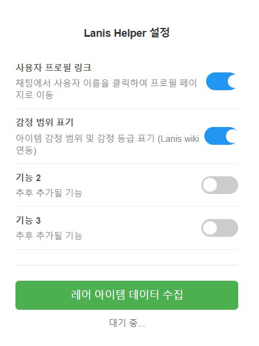
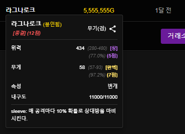
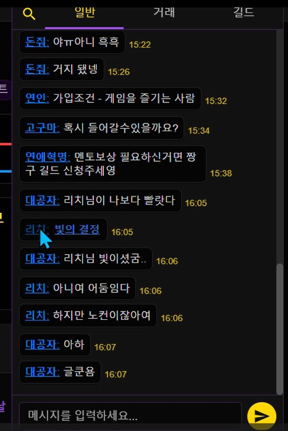
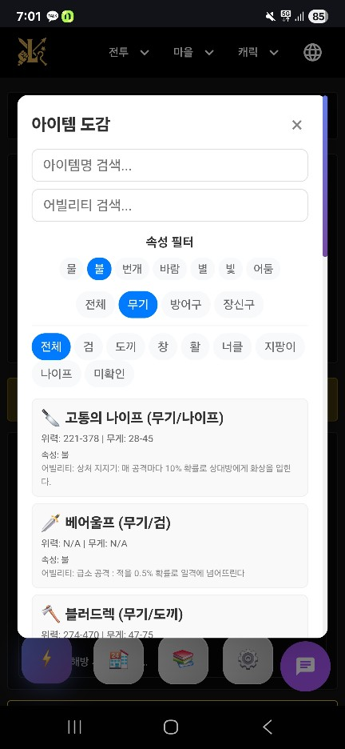
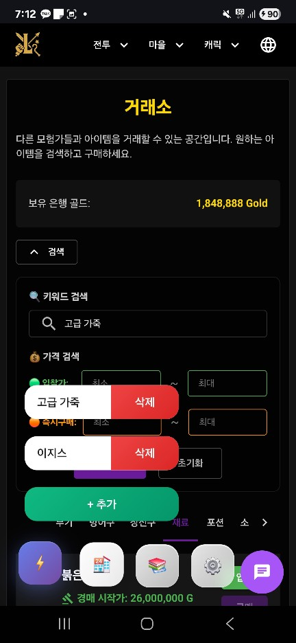

# Lanis Helper - 크롬 확장프로그램

Lanis 사용자 경험을 향상시키는 크롬 확장프로그램입니다.

## 🚀 설치 방법

### PC (Chrome 브라우저)

1. 이 프로젝트를 다운로드 합니다. (압축 해제 할 것)
2. Chrome 브라우저에서 `chrome://extensions/` 접속
3. 우측 상단의 "개발자 모드" 활성화
4. "압축해제된 확장 프로그램을 로드합니다" 클릭
5. 프로젝트 폴더 선택

### 모바일 (Android)

1. 이 프로젝트를 다운로드 합니다. (압축 해제 하지 말 것)
2. 플레이 스토어에서 Mises 브라우저 다운로드
3. 하단바에서 퍼즐모양 아이콘 클릭 -> 확장 프로그램 선택
4. 페이지에서 개발자모드 활성화
5. +(from .zip/.crx/.user.js) 항목 선택
6. 다운받은 zip 파일 불러오기

> **참고:**  
> 일부 설정 기능(팝업창 등)은 PC Chrome 환경에서만 정상 동작합니다.  
> 모바일(Mises 브라우저)에서는 팝업 UI가 지원되지 않으므로, 안내 메시지 또는 대체 UI가 제공됩니다.

## ✨ 주요 기능

### 사용자 프로필 링크
- 채팅에서 사용자 이름을 클릭하면 해당 사용자의 프로필 페이지로 이동

### 아이템 감정범위 표기
- Lanis 위키에서 레어 아이템 정보를 자동으로 수집
- 위력/무게/무기 타입/어빌리티 등 상세 정보까지 파싱하여 인게임 내 팝업에 렌더링

### 아이템 도감
- 메인 메뉴에서 "아이템 도감" 버튼 클릭 시, 전체 레어 아이템 목록을 모달로 표시
- 무기/방어구/장신구 등 카테고리별 분류 및 서브카테고리(검, 도끼 등) 지원
- 어빌리티/속성(물, 불, 번개 등) 다중 선택 필터링

### 퀵버튼/삭제버튼/추가버튼 UI
- 거래소 빠른 이동 버튼 지원

### 설정 메뉴 및 외부 링크
- 거래소 버튼 우측에 설정 버튼 노출
- 설정 메뉴에서 "위키 이동", "라니스 이동" 버튼을 통해 관련 페이지를 새 탭에서 바로 열기

## ⚙️ 설정 방법

아래와 같이 확장프로그램 아이콘을 클릭하면 설정창이 나타납니다.

- **사용자 프로필 링크**: 채팅에서 사용자 이름을 클릭하면 해당 사용자의 프로필 페이지로 이동합니다.
- **감정 범위 표기**: 아이템 감정 범위 및 등급(최하~최상, 종결/준종결)을 표시합니다.
- **아이템 도감**: 전체 레어 아이템을 카테고리/속성/어빌리티별로 검색 및 확인할 수 있습니다.
- **퀵버튼/삭제버튼/추가버튼**: 거래소 등에서 빠른 아이템 등록/삭제가 가능합니다.
- **설정 메뉴 외부 링크**: 위키, 라니스 게임 페이지를 새 탭에서 바로 열 수 있습니다.
- 하단에 상태 메시지가 표시됩니다(예: "대기 중...").

토글 스위치를 클릭하여 각 기능을 켜거나 끌 수 있으며, 설정은 즉시 저장되고 적용됩니다.

## 📝 사용법

### 레어 아이템 데이터 수집
1. Lanis 위키 페이지 접속
2. 확장프로그램 아이콘 클릭
3. "레어 아이템 데이터 수집" 버튼 클릭
4. 수집 완료까지 대기

### 퀵버튼/삭제버튼/추가버튼 사용
- 거래소 등에서 추가버튼(+)을 눌러 퀵버튼을 원하는 만큼 추가
- 각 퀵버튼 옆의 삭제버튼(빨간색)을 눌러 개별 삭제 가능

## 🔧 개발 정보

- **Manifest Version**: 3
- **지원 브라우저**: Chrome, (모바일: Mises 브라우저)
- **권한**: storage, tabs

## 📞 문의

문제가 발생하거나 개선 사항이 있으시면 라니스 메일함으로 메일주세요.  
닉네임 : 도히히님

## 🖼️ 사용 예시

### 레어 아이템 정보 툴팁 예시

- 각 아이템 감정 범위에 따라 등급을 매겨줍니다.
( ~ 30% / 30% ~ / 50% ~ / 70% ~ / 90% ~ ) ( 최하 / 하 / 중 / 상 / 최상 )
- 둘다 최상일 경우 ( 종결 ), 최상/상 조합일경우 ( 준종결 ) 태그가 붙습니다.

### 채팅창 사용자 프로필 링크 예시

- Lanis 채팅창에서 사용자 이름을 클릭하면 해당 사용자의 프로필 페이지로 이동할 수 있습니다.

### 아이템 도감 예시

- 카테고리별, 속성/어빌리티별로 아이템을 검색/필터링할 수 있습니다.
- 모바일에서도 반응형으로 확인 가능

### 퀵버튼/거래소 빠른이동 예시

- 퀵버튼 추가/삭제, 거래소 빠른이동 등 다양한 UI 개선이 적용되었습니다.